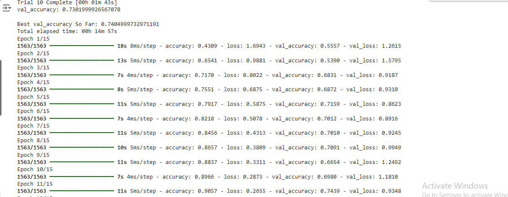
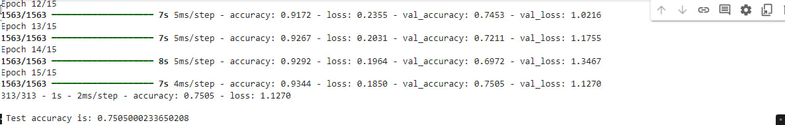
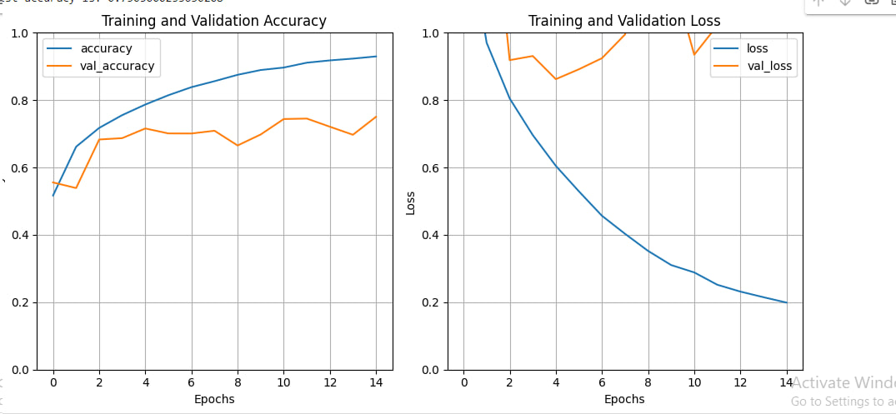

# 🌟 CIFAR-10 Image Classification with CNN 🌟

This project demonstrates how to build and optimize a Convolutional Neural Network (CNN) for classifying images from the CIFAR-10 dataset. 

## 📘 Project Description

The CIFAR-10 dataset comprises 60000 32x32 color images distributed across 10 different classes, with each class containing 6000 images. This project includes the following steps:
- **Data Loading**: Automatically load the CIFAR-10 dataset using TensorFlow's `datasets` module.
- **Pre-processing**: Normalize the image data and convert labels to one-hot encoding.
- **Visualization**: Display some training images for better understanding and visual inspection.
- **Model Building**: Construct a CNN model and use Keras Tuner to find the best hyperparameters.
- **Training**: Train the model using the best parameters identified.
- **Evaluation**: Assess model performance on a test set.
- **Reporting**: Plot and compare accuracy and loss for both training and validation phases.

## 🛠️ Libraries Required

The project utilizes a variety of Python libraries that are essential for data handling, model building, and visualization:

- TensorFlow and Keras for model building and deep learning.
- Matplotlib for plotting graphs.
- Pandas for data manipulation.
- Seaborn for enhanced data visualization.
- NumPy for numerical operations.
- Keras Tuner for optimizing model hyperparameters.

## 📁 Files Included
- `README.md`: Project description and setup instructions.
- `main_script.py`: Contains the entire script for model training, evaluation, and plotting.

## 🚀 How to Run
1. Ensure all dependencies are installed.
2. Run the script `main_script.py` to initiate the training process.
3. Observe the output, which includes accuracy, loss metrics, and visual plots.

## 📊 Model Architecture
The CNN model designed in this project includes:
- Several `Conv2D` layers with ReLU activation and batch normalization to extract features.
- `MaxPooling2D` layers to reduce spatial dimensions.
- `Flatten` layer to convert pooled feature maps into a single column that feeds into the dense layer.
- `Dense` layers with dropout to prevent overfitting and ensure generalization.

## 🔧 Hyperparameter Tuning
Hyperparameter tuning is conducted using `RandomSearch` from Keras Tuner, exploring various configurations to determine the most effective structure and parameters for our model.

## 📈 Results

